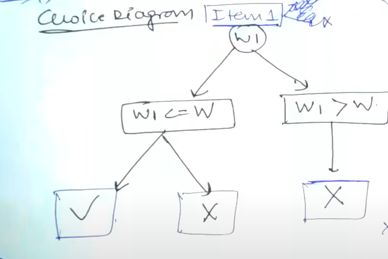
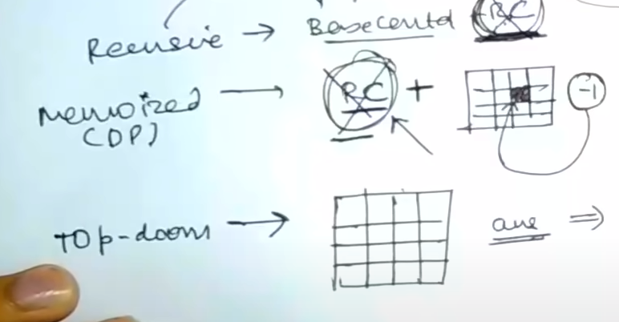
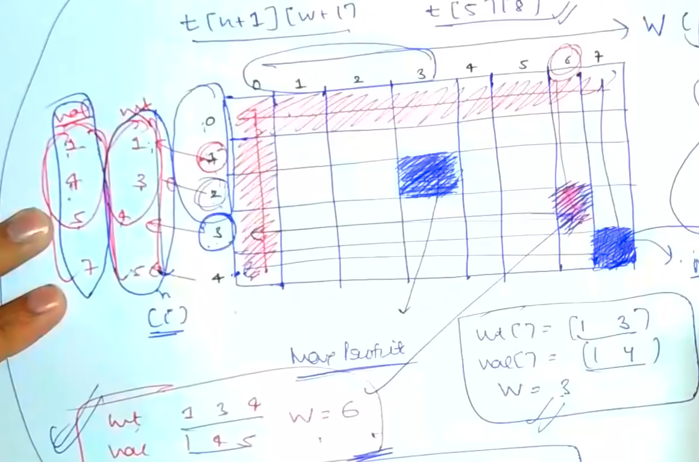
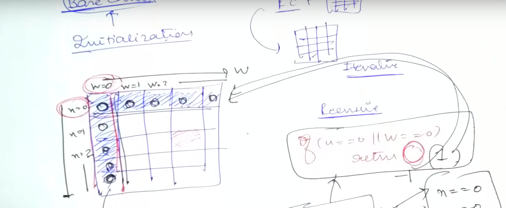

# [<](../Readme.md) 00 - 0/1 Knapsack Problem

### Problem Statement
Given a set of n items numbered(i) from 1 up to n, each with a weight w[i] and a value v[i], along with a maximum weight capacity W, maximize the sum of the values of the items in the knapsack so that the sum of the weights is less than or equal to the knapsack's capacity.
https://www.geeksforgeeks.org/problems/0-1-knapsack-problem0945/1?itm_source=geeksforgeeks&itm_medium=article&itm_campaign=bottom_sticky_on_article

### Identify

Optimal? -> Maximize values
Choice? -> Either selecting an item or NOT selecting an item

### Approach

Start with Recursive solution, then memoize it and then you can choose to apply top down approach.

### Recursice Code:
Input: Weight Array(w), Value Array(v), Capacity/Weight of Knapsack(W).

Output: Maximum Profit(Value)

We can say this is recursive solution, because we have a choice. And we can create a choice diagram.
Before writing recursive code, it is important to draw choice diagram.

For each item(i):
- if w[i] =< W:
    - we have choice of including the item or not.
- else:
    - we have no choice, we cannot include the item.

#### Function Signature:

```java
public int knapsack(int wt[], int val[], int W, int n);
```
In this function, we can have some skeleton code.
1. Base Case:
    - Think of the smallest valid input.
    - n can be 0 and W can be 0.
    - So, this becomes our base case.
    - If we have no items -> profit = 0
    - Similarly, if we have no W -> profit = 0
2. Choice Diagram:
    - Code the choice diagram (Easiest)
    - Simply convert the choice diagram that we drew in code.
    - Recursive call must always be on a smaller input.
    - In our case, we have to change n -> n-1

```java
public static int knapsack(int[] wt, int[] val, int W, int n) {
   // Base Case
   if (n == 0 || W == 0) return 0;
   //Choice Diagram
   int exclude = knapsack(wt, val, W, n - 1);
   if (wt[n-1] <= W) {
      // We have a choice
      int include = val[n - 1] + knapsack(wt, val, W - wt[n - 1], n - 1);
      return Math.max(include, exclude);
   } else {
      // We don't have a choice
      return exclude;
   }
}
```

### Memoize the recursive code

Memoization: To avoid making overlapping recursive calls. Or we can say, we are keeping track of solved sub-problems.

To convert recursive code to memoized code, we only have add 2 lines.
We can then move to top-down approach or not because memoized code is of similar power.

To memoize the code above, we have to have data structure that can store the memoized values.

Let's say we are deciding to create a matrix.
#### How do we choose the dimensions of the matrix?
Look at the inputs, the input which changes its size, grows smaller, it will define your matrix.
So, in the above case, we know `W` and `n` are getting smaller in recursive calls.
Therefore, we will need 2D matrix, and the dimensions will be `[n + 1][W + 1]`.
We want to set the entire matrix to `-1`.

Then, before making a recursive call, we will check the matrix, to see if the value is already calculated?
if yes, we return the value, else, we calculate the value and store in the matrix.

### How to memoize?
Changes we need to make:
1. Make a static matrix. and match the size to n, W constraints.
2. initialize it to -1.

```java
static int[][] t = new int[102][1002];
public static void main(String args[]) {
    for (int i = 0; i < 102; i++) {
        for (int j = 0; j < 1002; j++) {
            t[i][j] = -1;
        }
    }
}

public static int knapsack(int[] wt, int[] val, int W, int n) {
   // Base Case
   if (n == 0 || W == 0) return 0;
   // Memoize
   if (t[n][W] != -1) return t[n][W];
   //Choice Diagram
   int exclude = knapsack(wt, val, W, n - 1);
   if (wt[n-1] <= W) {
      // We have a choice
      int include = val[n - 1] + knapsack(wt, val, W - wt[n - 1], n - 1);
      int answer = Math.max(include, exclude);
      // Save the result before returning
      t[n][W] = answer;
      return answer;
   } else {
      // Save the result before returning
      t[n][W] = exclude;
      return exclude;
   }
}
```

There is not much of a change in memoization. But we can move to Top Down now.

### Top-down Approach
This is usually called "Real" Dynamic Programming. We will use old concepts to write top-down approach.
Until now, we wrote recursive code, and converted it to memoized code.
Now we are all set to move this code to Top-down Approach.

#### What does that mean?
We want to avoid making recursive call entirely.
(This is used when the number of recursive calls can cause stack overflow problem. This is a rare case.)


#### Process
We can come to top-down, from recursive code as well.
1. RC
2. RC + Table
3. Table

We need to make a table with dimensions `[n + 1][W  + 1]` the thinking should be similar to what we did for memoization.
We will fill this table in 2 steps.
1. Initialize
2. Recursive Calls --> Iterative Form

Dimension should be `n + 1 X W + 1` Because we want one row and column for base case or initialization.

In our Example:
```java
int[] wt = new int[]{1, 3, 4, 5};
int[] val = new int[]{1, 4, 5, 7};
int n = 4;
int W = 7;
```
In our table the value at `dp[i][j]` will denote what the o/p of function call with n = i and W = j.



The recursive function's base condition converts to top-down's initialization.
So, our n == 0 and W == 0 => return 0; changes to the first row to be 0s. and first column to be 1s.

Recursive Function has to be the perfect! for everything else to work.


```java
//if (n == 0 || W == 0) return 0

for(int i = 0; i < n + 1; i++) {
    for (int j = 0; j < W + 1; j++) {
        if (i == 0 || j == 0) {
            dp[i][j] = 0;
        }
    }        
}
```

Now lets move to recursive part.
We had written this code based on choice diagram. So, we will convert it to iterative form now.
Let us do Recursive V/s Top Down

Recursive
if (wt[n - 1][W - 1] <= W) {
return max(val[n - 1] + knapsack(wt, val, W - wt[n - 1], n - 1), knapsack(wt, val, W, n - 1));
} else {
return knapsack(wt, val, W, n - 1);
}

TopDown
if (wt[n - 1][W - 1] <= W) {
t[n][W] = max(val[n - 1] + dp[n - 1][W - wt[n - 1]], dp[n - 1][W]);
} else {
t[n][W] = dp[n - 1][W];
}
return t[n][W];

Convert, n => i and W => j (except for the loop code lines) also, run a loop to fill in each of the boxes.
```
for (int i = 1; i < n + 1; i++) {
   for (int j = 1; j < W + 1; j++) {
      if (wt[i - 1] <= j) {
         dp[i][j] = max(val[i - 1] + dp[i - 1][j - wt[i - 1]], dp[i - 1][j]);
      } else {
         dp[i][j] = dp[i - 1][j];
      }  
   }
}
```

### Solution

1. [Java](./src/Knapsack.java)