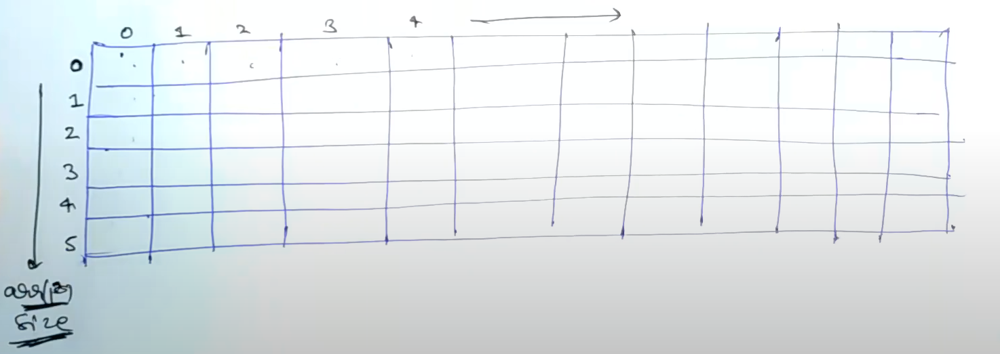

# [<](../Readme.md) 01 - Subset Sum Problem

## Problem Statement
Given a set of non-negative integers and a value sum, the task is to check if there is a subset of the given 
set whose sum is equal to the given sum.

https://www.geeksforgeeks.org/problems/subset-sum-problem-1611555638/1

### Examples:
```
Example 1:
Input: arr[] = {2, 3, 7, 8, 10}, sum = 11
Output: True
Explanation: There is a subset (3, 8) with sum 11.

Example 2:
Input: arr[] = {3, 34, 4, 12, 5, 2}, sum = 30
Output: False
Explanation: There is no subset that add up to 30.
```

Note: This problem only asks about if the subset is present or not. 
Which means we only return true or false.

## Similarity with Knapsack (Identification)
1. We have choice of either including a number or excluding it 
2. We have capacity - which here the sum.

Even though we do not have a value to optimize, we can consider the numbers
to be the weights. and we can only make sure that the weight is exactly equal to
the "capacity".

## Code Variation
Let's see what are code variations from traditional 01 knapsack

### Initialization
In this problem, `n` will be the length of the numbers array given to us and `W` will be
the sum that we are going to match.

So, for example:
```
Example 1:
Input: arr[] = {2, 3, 7, 8, 10} // n = 5
sum = 11
```
we will initialize a matrix of size `[n + 1][W + 1]`

```java
int[][] dp = new int[6][12];
```



Let's now fill this, the expected output is either true or false.

Now, the sub-problem at `dp[n][W]` will denote, what is the answer for an arr of length `n` and the sum `W`.
So while initializing, we will set our base case condition `n == 0`
to `true` and THEN for condition `W == 0` for any n `false`.

```java
public static void main(String[] args) {
    for (int i = 0; i < n; i++) {
        for (int j = 0; j < W; j++) {
            if (i == 0) dp[i][j] = false;
            if (j == 0) dp[i][j] = true;
        }
    }
}
```

Comparison with Knapsack
wt[] ==> arr[]
W ==> sum

Maximum does not make sense ==> Convert it to OR.

## Code
```java
public static void main(String[] args) {
    if (arr[i - 1] <= j) {
        // When we have choice, if we have any one True, we can return True.
        dp[i][j] = dp[i - 1][j] || dp[i][j - arr[i - 1]];
    } else {
        // We do not have choice, we simply copy the o/p from previous valid inputs.
        t[i][j] = dp[i - 1][j];
    }
    return dp[n][W];
}
```

### Solution

1. [Java](./src/SubsetSum.java)

