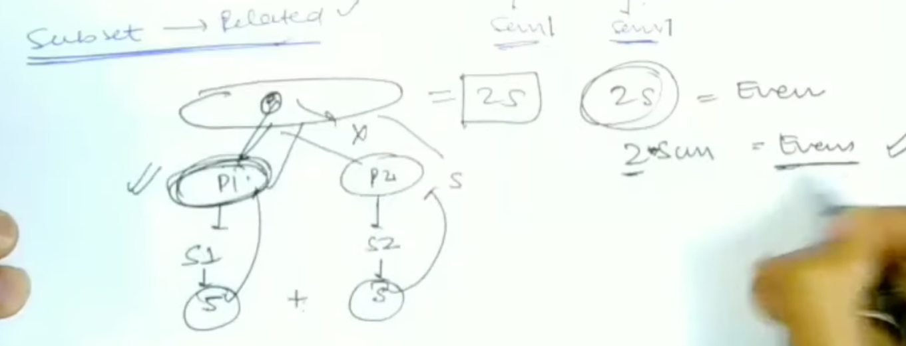

# [<](../Readme.md) 02 -  Equal Sum Partition

## Problem Statement

Given an array arr[] of size N, check if it can be partitioned into two 
parts such that the sum of elements in both parts is the same.

Example 1:
```
Input:
N = 4
arr = {1, 5, 11, 5}
Output: YES
Explanation: 
The two parts are {1, 5, 5} and {11}.
```

Example 2:
```
Input: N = 3
arr = {1, 3, 5}
Output: NO
Explanation: This array can never be 
partitioned into two such parts.
```

#### Your Task:  
You do not need to read input or print anything. 
Your task is to complete the function equalPartition() which takes the value N and the array as input parameters and 
returns 1 if the partition is possible. Otherwise, returns 0.

Expected Time Complexity: O(N*sum of elements)
Expected Auxiliary Space: O(sum of elements)

#### Constraints:
1 ≤ N ≤ 100
1 ≤ arr[i] ≤ 1000
N*sum of elements ≤ 5*106

## Subset Sum Similarity
Subset sum looks something like this: 
```java
class Solution {
    boolean subsetSum(int arr[], int sum, int n) {
        boolean[][] dp = new boolean[n + 1][sum + 1];

        // Initialize
        for (int i = 0; i < n + 1; i++) {
            for (int j = 0; j < sum + 1; j++) {
                if (i == 0) dp[i][j] = false;
                if (j == 0) dp[i][j] = true;
            }
        }

        for (int i = 1; i < n + 1; i++) {
            for (int j = 0; j < sum + 1; j++) {
                if (arr[i - 1] <= j) {
                    // have choice, so if any one of them is true the ans should be true.
                    dp[i][j] = dp[i - 1][j - arr[i - 1]] || dp[i - 1][j];
                } else {
                    // have no choice.
                    dp[i][j] = dp[i - 1][j];
                }
            }
        }

        return dp[n][sum];
    }
}
```

In Equal sum partition, we are going to find if subset sum is equal for both the subsets.
We will create subset in. The sum of the entire array has to be even. We do not have  

## Odd-Even Significance


If sum of the entire arr is odd, then we can blindly return False.
Else, we will have to think of a plan.

## Code Variation
Pseudo Code:
- Calculate the sum of the arr.
- If the sum is odd -> return false
- Else, check if we have 1 subset, which has total = sum / 2.
- If we get the answer as True. Then we can return True.
- So basically, we can simply reuse the subset sum code here.

```java
class Solution {
    public static boolean equalPartition(int arr[], int n ){
        int sum = 0;
        for (int i  = 0; i < n; i++) {
            sum += arr[i];
        }
        
        // check if sum is even
        if (sum % 2 != 0) return false;
        
        // if it is even then we can find a subset with sum / 2 as total.
        boolean[][] dp = new boolean[n + 1][(sum / 2) + 1];

        // Initialize
        for (int i = 0; i < n + 1; i++) {
            for (int j = 0; j < (sum / 2) + 1; j++) {
                if (i == 0) dp[i][j] = false;
                if (j == 0) dp[i][j] = true;
            }
        }

        for (int i = 1; i < n + 1; i++) {
            for (int j = 0; j < (sum / 2) + 1; j++) {
                if (arr[i - 1] <= j) {
                    // have choice, so if any one of them is true the ans should be true.
                    dp[i][j] = dp[i - 1][j - arr[i - 1]] || dp[i - 1][j];
                } else {
                    // have no choice.
                    dp[i][j] = dp[i - 1][j];
                }
            }
        }

        return dp[n][sum / 2]; 
    }
}

```

