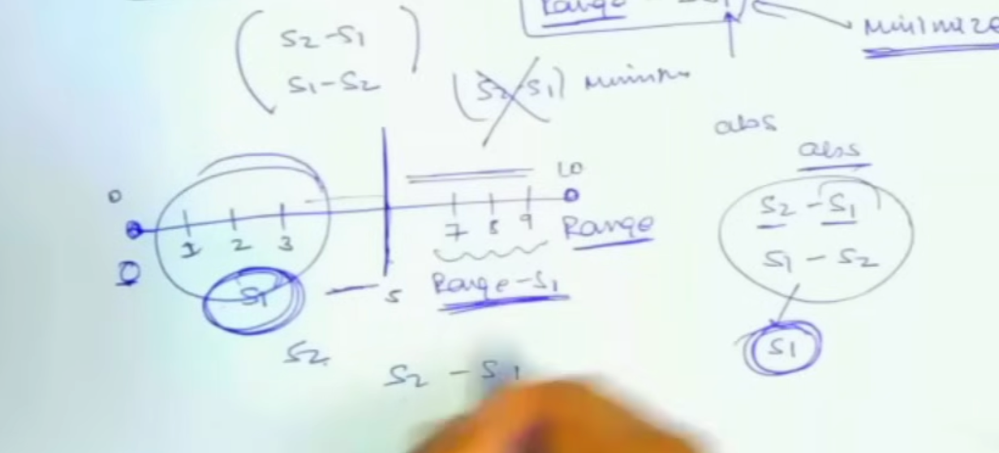

# [<](./../Readme.md) 04 - Minimum Subset Sum Difference

## Problem Statement
Given an array arr of size n containing non-negative integers, the task is to divide it into two sets S1 and S2 such that the absolute difference between their sums is minimum and find the minimum difference
https://www.geeksforgeeks.org/problems/minimum-sum-partition3317/1

We are asked S1 - S2 to be minimum. So the o/p should be this value abs(s1 - s2)
If we compare against ESpartition, here we are doing S1 - S2 to be minimum, instead of 0.

## Similarity
Let's see how this is similar to Subset Sum. 

How to decide S1 and S2 value? -> We can decide the range.
- extreme value is {} or full array.
- Therefore, the range of S1 and S2 will be from 0 to sum(arr) included.

- In this range, every number will not qualify to be a potential value for S1 and S2.

## Sum Up
- We are given an array, which we want to divide in 2 parts, with sum s1 and s2. 
- and we want to minimize abs(s1 - s2).
- But we have derived, the range for s1 and s2 will be 0 to sum(arr).
- Also, our value abs(s2 - s1) ==> abs(range - s1 - s1) ==> abs(range - 2*s1)
- We know we want to get maximum s1 smaller than sum(arr) // 2.
- Now, we will calculate, sum(arr) - s1 and minimize this value.

## Solve using old concepts
- How to do this?
  - Recall subset sum
  
- First solve for subset sum, then get the numbers which have True in the last row of DP array.
- Finally, filter this again for going upto half.
- In the end, check these candidates for minimizing sum - 2*s1.

## Code

1. [Java](./src/MinDifference.java)