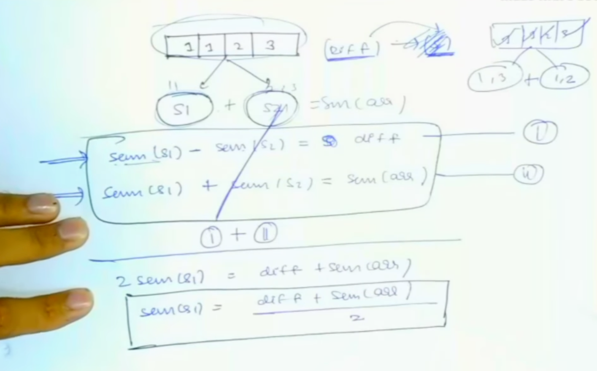
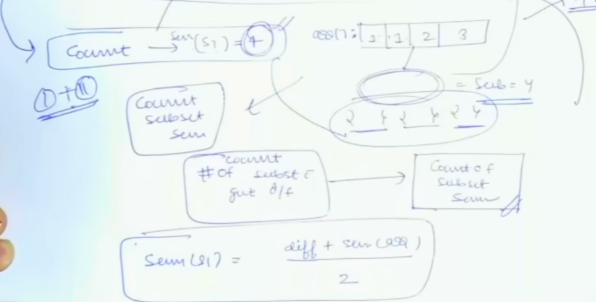

# [<] 05 Count the number of subsets with given difference

## Problem Statement
Given an array arr, partition it into two subsets(possibly empty) such that each element must belong to only one subset. Let the sum of the elements of these two subsets be S1 and S2.
Given a difference d, count the number of partitions in which S1 is greater than or equal to S2 and the difference between S1 and S2 is equal to d. Since the answer may be large return it modulo 109 + 7.

https://www.geeksforgeeks.org/problems/partitions-with-given-difference/1?itm_source=geeksforgeeks&itm_medium=article&itm_campaign=bottom_sticky_on_article

## Reduce the problem statement
We have a seen a problem where we solved all possible differences in subset sums. So this should be easier.
Now, we have been given the target difference.

We have difference, we have sum(arr) as well.
Once we calculate s1, we will be able to count the number of subsets with that sum.
Now, we can reuse count of subset sum solution here.

## Solve using already solved problem
Simply first calculate what should be S1. Then use countOfSubsetSum and return the answer.
 