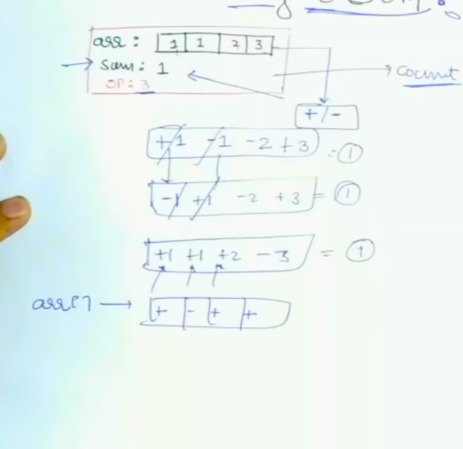
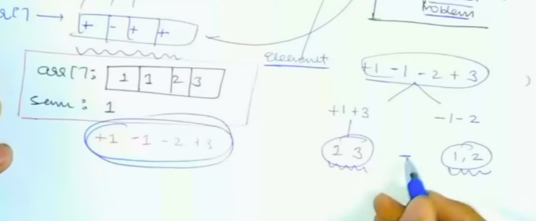

# [<](./../Readme.md) 06 - Target Sum

## Problem Solution
Given an array of integers A[] of length N and an integer target.
You want to build an expression out of A by adding one of the symbols '+' and '-' before each integer in A and then concatenate all the integers.

For example, if arr = {2, 1}, you can add a '+' before 2 and a '-' before 1 and concatenate them to build the expression "+2-1".
Return the number of different expressions that can be built, which evaluates to target and return your answer with modulo 109+7

https://www.geeksforgeeks.org/problems/target-sum-1626326450/1

## Solving it and Reducing it
This could be reduced to sum of difference. (countSubsetsWithGivenDifference)

## Solve it using already solved problem
This is same as [prev](./../05-countSubsetsWithGivenDiff/Readme.md)

## Code
1. [Java](./src/TargetSum.java)