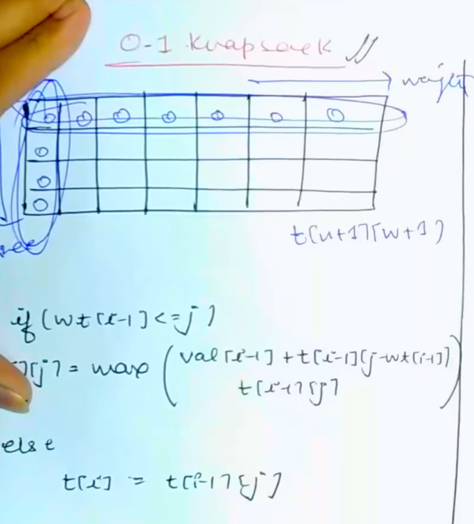
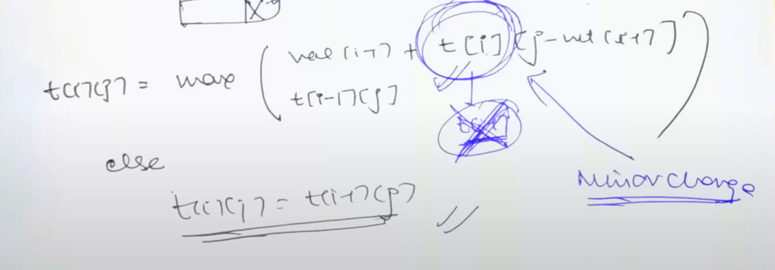

# [<](../Readme.md) Unbounded Knapsack Problem

### Recall Differences w.r.t. [01 knapsack](../../01-knapsack/Readme.md)
1. Multiple occurrence of the same item is allowed
2. In this case, if we "Reject" an Item, we will not look at it again,
   But if we choose it, it will still be unprocessed. Which is exact opp. of 01 Knapsack
3. This means there is a pretty small difference in

### Code Variation
01-knapsack

Unbounded Knapsack - Init is same. Only difference is the recursive call.

