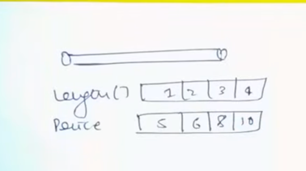

# [<](../Readme.md) 01 - Rod Cutting Problems

## Problem Statement
Given a rod of length N inches and an array of prices, price[]. 
price[i] denotes the value of a piece of length i. 
Determine the maximum value obtainable by cutting up the rod and selling the pieces.

Note: Consider 1-based indexing.
``` 
Example 1:

Input:
N = 8
Price[] = {1, 5, 8, 9, 10, 17, 17, 20}
Output:
22
Explanation:
The maximum obtainable value is 22 by
cutting in two pieces of lengths 2 and
6, i.e., 5+17=22

Example 2:

Input:
N=8
Price[] = {3, 5, 8, 9, 10, 17, 17, 20}
Output: 
24
Explanation: 
The maximum obtainable value is 
24 by cutting the rod into 8 pieces 
of length 1, i.e, 8*price[1]= 8*3 = 24.
```

In some questions, they will not give us length array as input. Because it can be generated easily.

## Matching

- Items ===== Pieces
- Weight ====== Length
- Value ====== Price
- N ===== W (Capacity ------ Total Length of Rod)



We have Choice: 


And this is unbounded, because the pieces can be of the same size... (Repeated).

## Code Variation

The explanation is same as unbounded knapsack. Same problem statement. But with different words.
There is no Code Variation!


## Code

[JavaCode](./src/RodCutting.java)