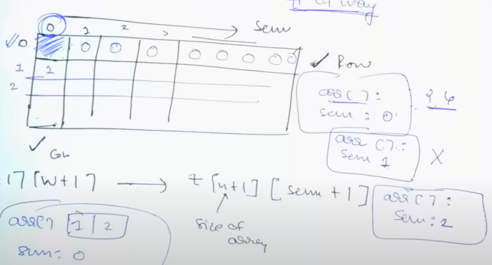
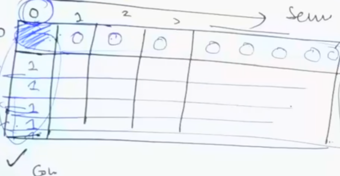

# [<](../Readme.md) 02 Coin Change Problem

This problem is of 2 types:
1. Max number of Ways
2. Min number of Coins

## Problem Statement

Given an integer array of coins[] of size N representing different types of denominations and an integer sum, the task is to count all combinations of coins to make a given value sum. 

Input: sum = 4, coins[] ={1, 2, 3}
Output: 4
Explanation: there are four solutions 
1. {1, 1, 1, 1}
2. {1, 1, 2}
3. {2, 2}
4. {1, 3}

## Why Knapsack?

We get a choice at every coin weather to include or not to include.

## Why Unbounded?

We know we have unlimited supply of coins of each type, so it becomes Unbounded.

## Matching
1. wt ==> coin
2. W ==> sum

## Recall Subset Sum:

In sumset sum we wanted to return yes or no if the subset sum equals to the required sum?

```java
if(arr[i - 1] <= j){
    t[i][j] = t[i -1][j -1] || t[i -1][j -arr[i -1]]
}
else {
    t[i][j] = t[i - 1][j]
}
```

We were using || because we were saying yes or no, but now we need to count number of ways so, 
we will be using + instead of ||.

## Initialization

dp[n + 1][sum + 1]
First Row and First Column we have to fill.

If size of array is 0. Then it should be 0.


If sum is 0 then, it should be 1.


## In our code, we should make sure, that, We are taking into consideration that It is Unbounded Knapsack

[code here](./src/CoinChangeProblem.java)
[leetCode](https://leetcode.com/problems/coin-change-ii/submissions/1328819214/)

