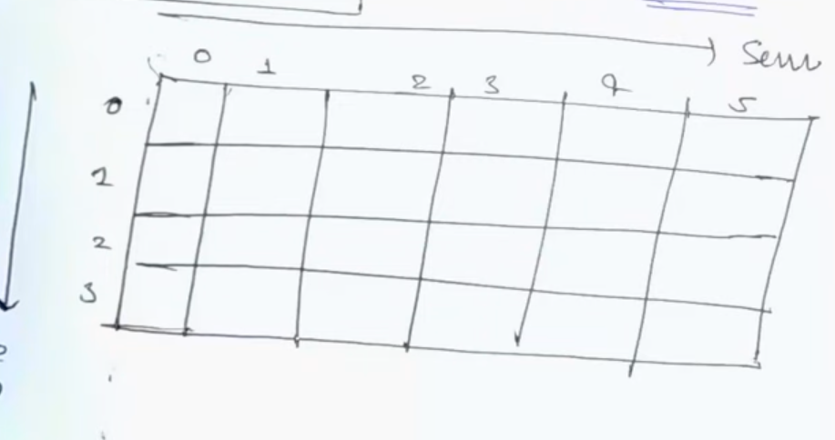
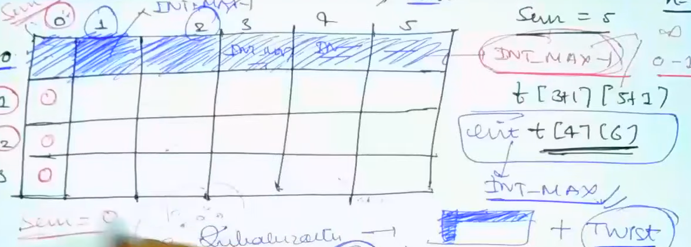
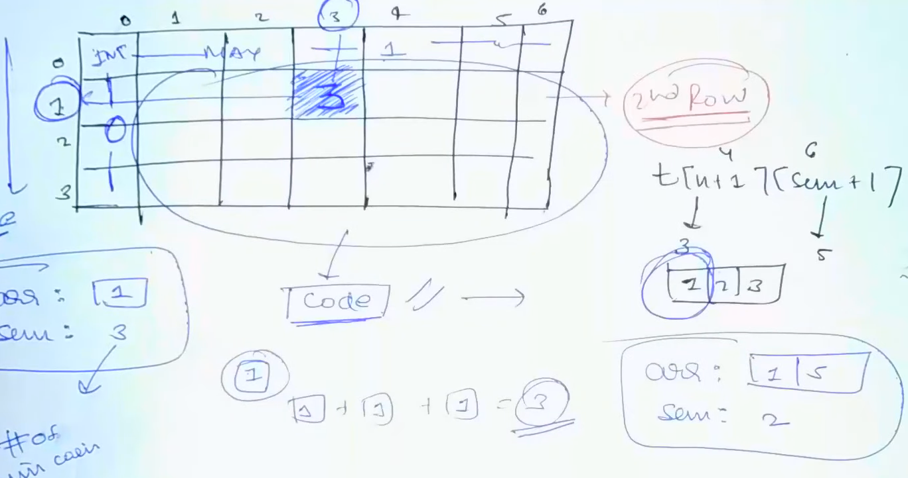
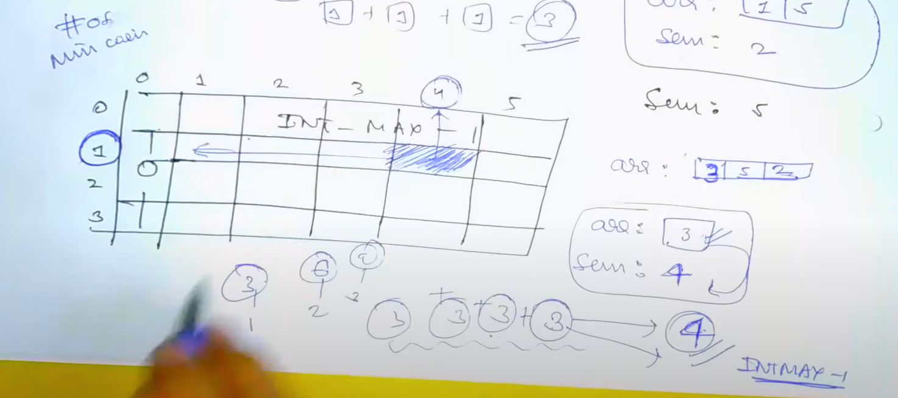

[<](../Readme.md) Coin Change Problem Minimum number of coins.

# Problem Statement

This is similar to other coin change problem that we did, but the o/p that we give 
should be different from what we have given earlier.

"Minimum number of Coins"

## Initialization

t[n + 1][sum + 1] This is same as what we had for knapsack

n = size of array
sum = target sum

we initialize a metrix of size n + 1 X sum + 1.


To initialize, lets initialize first row and first column.
in the first row, we might want to set infinity.(intMax - 1). 
We will discuss the reason later.
First column will be set to 0.


We need to initialize the second row as well



For second row, we need to add some logic:

```
// Only for second row
for(int i = 1; i < sum + 1; i++){
    if (i % arr[0] == 0) t[i][j] = i / arr[0];
    else t[i][j] = INTMAX - 1;
}
```

- We are doing this because, we cannot determine by any operation on rows 1 and 2.
- Unbounded KNapsack code

```java
// FROM
if (wt[i - 1] <= j) {
    t[i][j] = max(val[i - 1] + t[i][j - wt[i - 1]], t[i-1][j]);     
} else {
    t[i][j] = t[i-1][j]
}

//TO
if (coin[i-1] <= j) {
        t[i][j] = min(1 + t[i][j - coin[i - 1]], t[i - 1][j]);
} else {
        t[i][j] = t[i - 1][j]
}
```