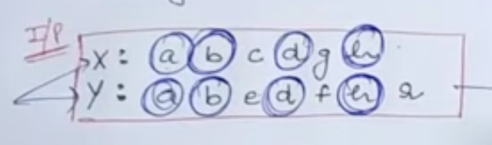
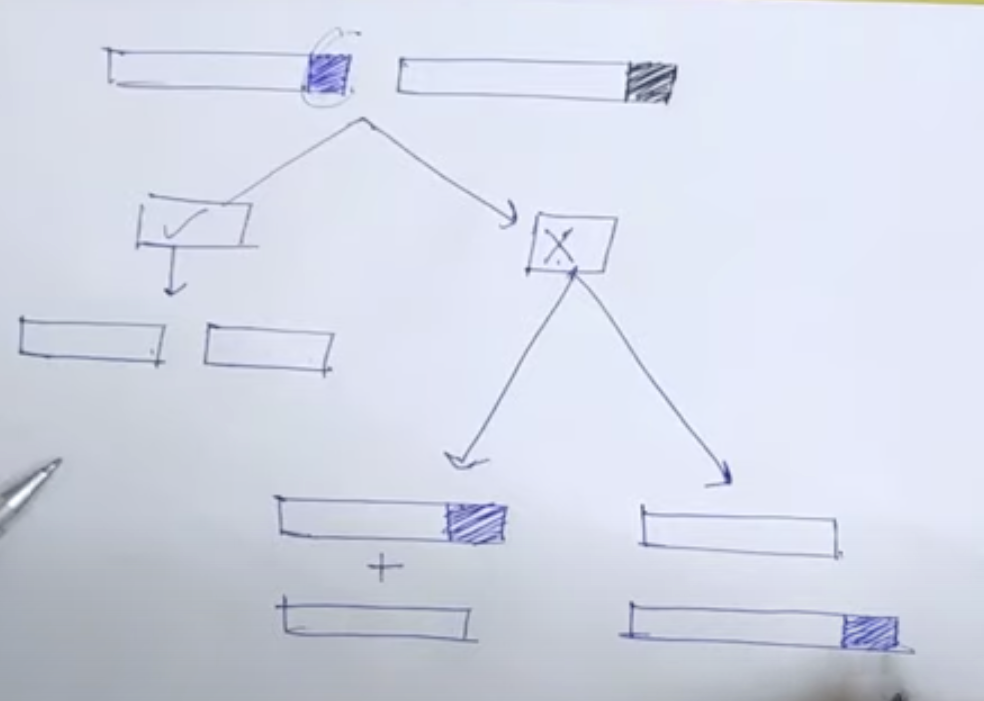
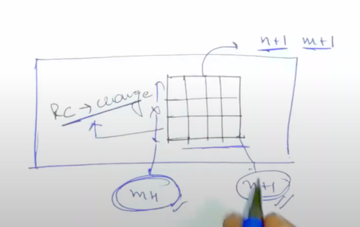

# [<](../Readme.md) 00 Longest Common  Subsequence

## Problem Statement
Given two strings str1 & str 2 of length n & m respectively, 
return the length of their longest common subsequence. If there is no 
common subsequence then, return 0.

https://www.geeksforgeeks.org/problems/longest-common-subsequence-1587115620/1?itm_source=geeksforgeeks&itm_medium=article&itm_campaign=bottom_sticky_on_article

Example 1
```
Input: n = 6, str1 = ABCDGH and m = 6, str2 = AEDFHR
Output: 3
```


## What is a subsequence?

A subsequence means, sequence of characters which may not necessarily be a substring.

## Ans = 4 (length of the subsequence)

## Base Condition

- The strings length is 0?
- Smallest Valid input.

```java
if (n == 0 || m == 0) return 0;
```

### Choice Diagram

- What choices do we have?
  - X: abcdgh
  - Y: abedfh
- When characters from the string match, we have 1 choice,
- However, when they do not match we have 2 choices.

The choice diagram will look like this:


### Let's figure out parameters
1. we will pass 4 params
    - String x
    - String y
    - Length of x
    - Length of y

```java
int LCS(String x, String y, int m, int n) {
    if (n == 0 || m == 0) return 0;
    if (x[m - 1] == y[n - 1]) {
        // Plus 1 because character is common
        return 1 + LCS(x, y, m - 1, n - 1);
    } else {
        // No Plus 1 because character is not common
        return Math.max(LCS(x, y, m - 1, n), LCS(x, y, m, n - 1);
    }
}

```

### Memoization

#### Why we need memoization?

- We need to memoize the function because there can be repeated recursive calls.
- we need to memoize only in case of multiple recursive calls
- We don't want to solve already solved sub-problems.

We have learnt from alvin as well. That we dont want to solve already solved problems.

#### How to know the table size?

For determining the table size, we need to first find out what are the variables that affect the table?
in this case we have strings X, Y, m, n. (Changing variables in the recursive call).

For our problem we will use m and n, because these are being changed in the recursive call.



We have (m + 1) X (n + 1) as the size of the table.
To make sure we have the last value of the table to be `t[m][n]`.

#### How will we use the table?

Before making a recursive call, we have to check if this table has the solution already.
So, for indicating, we will initialize the metrix with -1
Do this in the main function.
```java
for (int i = 0; i < m + 1; i++) {
        for (int j = 0; j < n + 1; j++){
            t[i][j] = -1;
        }}
```
