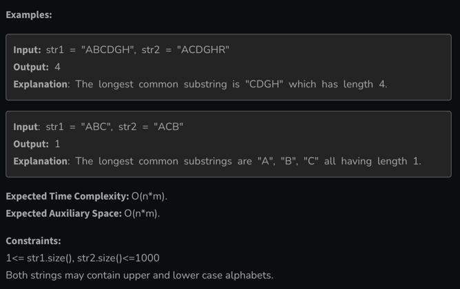

# [<](../Readme.md) 01 Longest Common Substring

## [Problem Statement](https://www.geeksforgeeks.org/problems/longest-common-substring1452/1?itm_source=geeksforgeeks&itm_medium=article&itm_campaign=practice_card)
You are given two strings str1 and str2. Your task is to find the length of the longest common substring among the given strings.


### signature
```java
class Solution {
    public int longestCommonSubstr(String str1, String str2) {
        // code here
    }
}
```

## How this is similar to LCS?
- Similarities
  - 2 Strings are given (Longest Common)
  - o/p format - length is asked
- Difference
  - We are still looking for common letters, but the difference is we have to check for continuous letters.

### Explanation
- we have to reset the length as we find a non-common letter.

## Code Variation
### Initialization
- Same as LCS (i == 0 || j == 0) answer = 0.
```java
class Initialization {
    int m = 5;
    int n = 5;
    int[][] dp = new int[m + 1][n + 1];

    static void initialize() {
        for (int i = 0; i <= m; i++) {
            for (int j = 0; j <= n; j++) {
              if (i == 0 || j == 0) dp[i][j] = 0;
              else dp[i][j] = -1;
            }
        }
    }
}
```
### Code Variation
- We start with LCS memoized code. we are resetting the length when we find a dissimilar letter.
```java
public class LCSubstring {
    static int lcs3(String s1, String s2, int m, int n, int[][] dp) {
      Initialization.initialize();
        for (int i = 1; i < m + 1; i++) {
          for (int j = 1; j < n + 1; j++) {
            if (dp[m][n] == -1) {
              if (s1.charAt(i - 1) == s2.charAt(j - 1)) {
                dp[i][j] = 1 + dp[i - 1][j - 1];
              } else {
                dp[i][j] = 0; // This is what we changed.
              }
            }
          }
        }
        return dp[m][n];
    }
}
```


## Complete Code Links