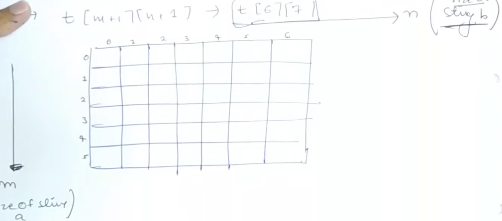
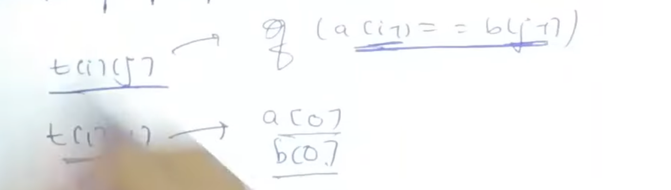
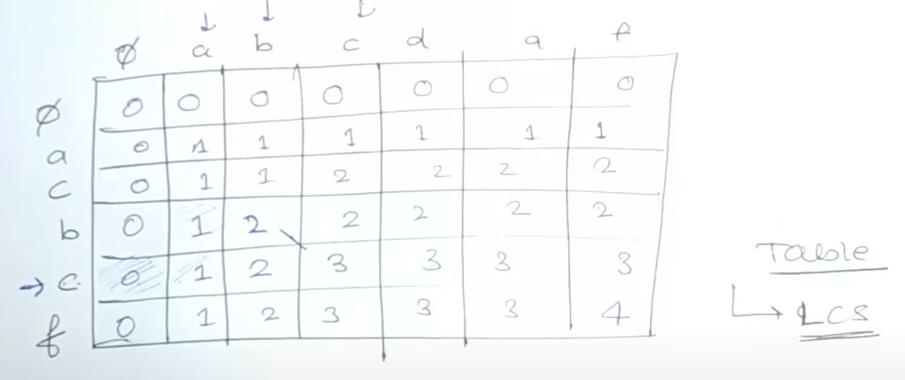
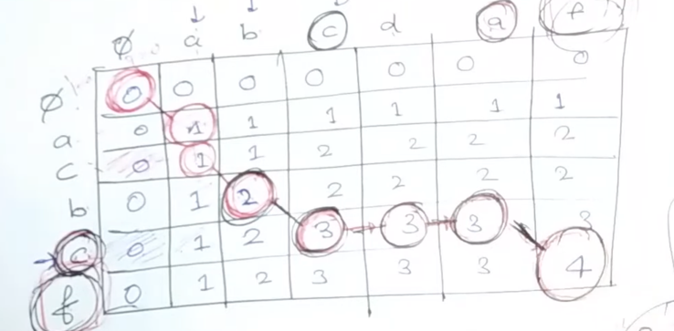

# [<](../Readme.md) 02 Print the Longest Common Substring

## [Problem Statement]

Your task is to print the length of the longest common substring among the given strings.

```text
Example: 
a = "acbcf"
b = "abcdaf"

o/p: abcf
```

### signature
```java
class Solution {
    public String printLongestCommonSubstring(String str1, String str2) {
        // code here
    }
}
```

## How this is similar to LCS?
- Similarities
    - We are still doing Longest Common Subsequence.
- Difference
    - This time around we want to "Print" the LCS instead of length.
    - o/p is String instead of Integer
- Parent question is LCS.

### Explanation


Let us first fill the table the way we did for LCS. 
- 
- Now let us think of how we can print the sequence.
- For doing this lets think about our LCS code.
  - If the character matches, we go diagonally and add 1. ```dp[i][j] = dp[i - 1][j - 1] + 1```
  - So, if the character matches: we add the current char to o/p string and move diagonally back ```i--; j--;```
  - If the character doesn't match, we take maximum of ```dp[i-1][j] and dp[i][j-1]```
  - So, if the character doesn't match, we will find the maximum of the 2 and move to that direction ```i--; OR j--;```
- Getting some idea?
  - 

## Code Variation
- Very similar to LCS original, we just need another pass from the Table, to build our output string.

### Initialization
- Same as LCS
```java
class Initialization {
    public static void init(int[][] dp) {
        for (int i = 0; i < dp.length; i++) {
            for (int j = 0; j < dp[0].length; j++) {
              if (i == 0 || j == 0) dp[i][j] = 0;
              else dp[i][j] = -1;
            }
        }
    }
}
```

### Code Variation
```java
class Solution{
    public String printLongestCommonSubstring(String str1, String str2) {
      int m = str1.length();
      int n = str2.length();
      int[][] dp = new int[m+1][n+1];
      Initialization.init(dp);
      for (int i = 1; i < m + 1;i++) {
        for (int j = 1; j < n + 1; j++) {
          if (str1.charAt(i) == str2.charAt(j)) {
            dp[i][j] = 1 + d[i - 1][j - 1];
          } else {
            dp[i][j] = Math.max(dp[i-1][j], dp[i][j-1]);
          }
        }
      }
      // Finding the subsequence
      int i = m;
      int j = n;
      String subsequence = "";
      while (i > 0 && j > 0) {
        if (str1.charAt(i) == str2.charAt(j)) {
          subsequence = str1.charAt(i) + subsequence;
          i--;
          j--;
        } else {
          if (dp[i - 1][j] > dp[i][j - 1]) {
            i--;
          } else {
            j--;
          }
        }
      }
      return subsequence;
    }
}
```

## Complete Code Links