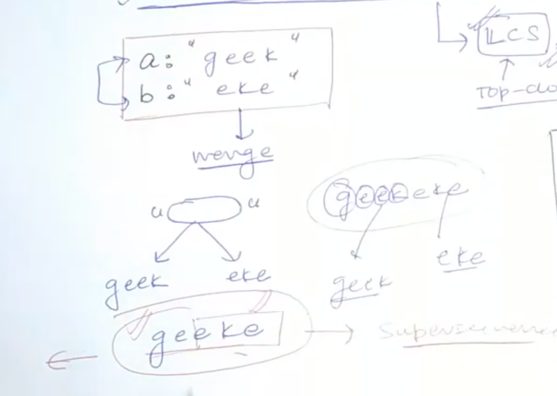
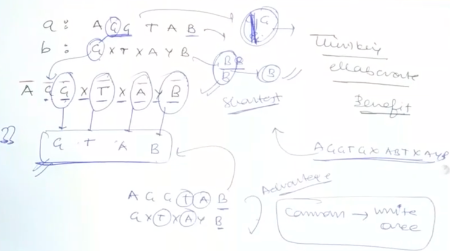

# [<](../Readme.md) 03 Shortest Common Super Sequence

## [Problem Statement](https://leetcode.com/problems/shortest-common-supersequence/description/)
Given two strings `str1` and `str2`, return the shortest string that has both `str1` and `str2` as subsequences. 
If there are multiple valid strings, return any of them.

### What is subsequence?
A string `s` is a subsequence of string `t` if deleting some number of characters from `t` (possibly 0) results in the string `s`.


### Example 1:
```text
Input: str1 = "geek", str2 = "eke"
Output: "geeke"
```

### Explanation: 
str1 = "abac" is a subsequence of "cabac" because we can delete the first "c".
str2 = "cab" is a subsequence of "cabac" because we can delete the last "ac".
The answer provided is the shortest such string that satisfies these properties.

### Constraints:
```text
1 <= str1.length, str2.length <= 1000
str1 and str2 consist of lowercase English letters.
```

### signature
```java
class Solution {
    public String shortestCommonSupersequence(String str1, String str2) {

    }
}
```

## How this is similar to LCS?
- What is the easiest way to write a super sequence?
  - We can simply concatenate both the strings.
  - But in doing that we are repeating some letters.
  - 
  - Notice the letters that repeat are nothing but LCS of the 2 strings.

### Explanation
- So, we can shorten the super sequence by just reducing the letters in LCS.
  - The shortest Super sequence length will be
    - Length of str1 + Length of str2 - Length of LCS
- We will simply reuse the LCS code to solve this problem.
- 

## Code Variation
```NO VARIATION```

### Initialization
```NO VARIATION```

### Code Variation
```NO VARIATION```

## Complete Code Links