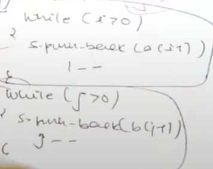

# [<](../Readme.md) 04 Print Shortest Common Super Sequence

## Problem Statement
Given two strings `str1` and `str2`, return the shortest string that has both `str1` and `str2` as subsequences.
If there are multiple valid strings, print the resulting SCS.

### What is subsequence?
A string `s` is a subsequence of string `t` if deleting some number of characters from `t` (possibly 0) results in the string `s`.


### Example 1:
```text
Input: str1 = "geek", str2 = "eke"
Output: "geeke"
```

### signature
```java
class Solution {
    public String printShortestCommonSupersequence(String str1, String str2) {

    }
}
```

## How this is similar to LCS?
- What is the easiest way to write a super sequence?
    - We can simply concatenate both the strings.
    - But in doing that we are repeating some letters.
    - Notice the letters that repeat are nothing but LCS of the 2 strings.
- This is time we have to print the SCS
- Similar to printLCS ===|
- How? 
- We will first use printLCS to get the actual LCS.
- To modify this, we will add the chars which are not common to the answer string.



## Code Variation
- From printLCS
```java
public class PrintLCS{
    
    static String printLongestCommonSubstring(String str1, String str2) {
        int m = str1.length();
        int n = str2.length();
        int[][] dp = new int[m+1][n+1];
        // Finding the subsequence
        int i = m;
        int j = n;
        String subsequence = "";
        while (i > 0 && j > 0) {
            if (str1.charAt(i - 1) == str2.charAt(j - 1)) {
                subsequence = str1.charAt(i - 1) + subsequence;
                i--;
                j--;
            } else {
                if (dp[i - 1][j] > dp[i][j - 1]) {
                    subsequence = str1.charAt(i - 1) + subsequence; // include the character that did not match
                    i--;
                } else {
                    subsequence = str2.charAt(j - 1) + subsequence; // include the character that did not match
                    j--;
                }
            }
        }
        // Print remaining characters form any string that we did not traverse completely
        if (i != 0) subsequence = str1.substring(0, i) + subsequence;
        if (j != 0) subsequence = str2.substring(0, j) + subsequence;
        return subsequence;
    }

    public static void main(String[] args) {
        String s1 = "mrinmayee";
        String s2 = "dmhanashree";
        System.out.println(printLongestCommonSubstring(s1, s2)); // Output: dmrihanmayshree 
    }
}
```

### Initialization
```NO VARIATION```