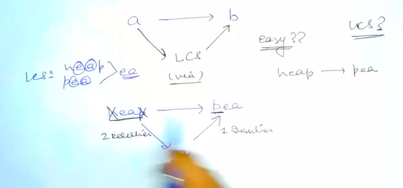

# [<](../Readme.md) 05 Minimum Number of insertions and deletions

## [Problem Statement](https://www.geeksforgeeks.org/problems/minimum-number-of-deletions-and-insertions0209/1)
Given two strings `str1` and `str2`. The task is to remove or insert the minimum number of characters from/in `str1` so as to transform it into `str2`. 
It could be possible that the same character needs to be removed/deleted from one point of `str1` and inserted to some another point.

### Example 1:
```text
Input: str1 = "heap", str2 = "pea"
Output: 1 2
# [# insertions, # deletions]
```

### signature
```java
class Solution {
    public String minimumInsertionsOrDeletions(String str1, String str2) {

    }
}
```

## How this is similar to LCS?
- We are given 2 Strings and We have find something optimal
- So, we an think in the form of LCS
- I/p Format:
  - Given 2 strings "a" and "b"
- O/p Format:
  - Give a number of operations


### Explanation
- So, what are letters that we will not touch?
  - They are nothing but the LCS of the 2 strings
- To convert str1 to str2 
  - we will first convert str1 to LCS
  - then convert LCS to str2
- So, the number of operations will be [(Length of str1 - Length of LCS), (Length of str2 - Length of LCS)]
- So, Again no code variation. We are extending on str1



## Code Variation
```NO VARIATION```

### Initialization
```NO VARIATION```

### Code Variation
```NO VARIATION```

## Complete Code Links