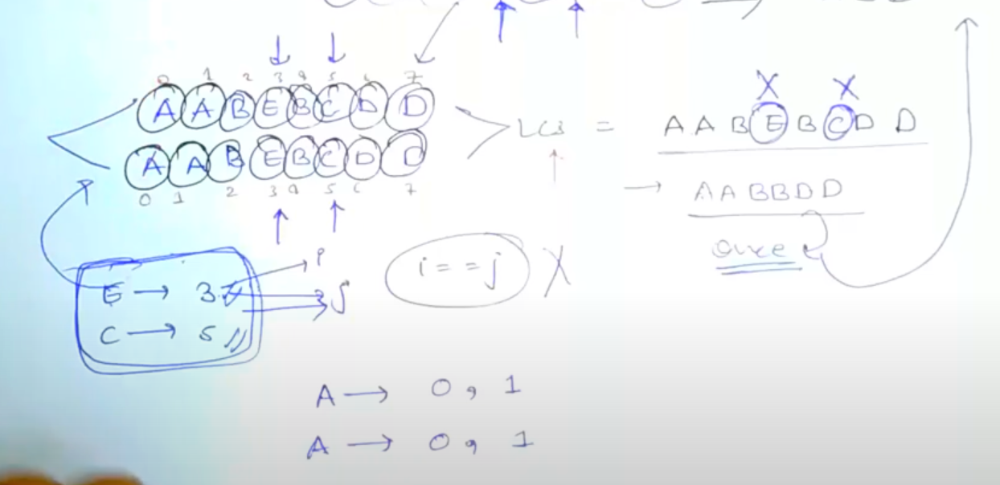

# [<](../Readme.md) 13 Minimum Number of deletions to make it a palindrome

## [Problem Statement](https://www.geeksforgeeks.org/longest-repeated-subsequence/)

Given a string, find the length of the longest repeating subsequence, such that the two subsequences don’t have same string character at the same position, i.e. any ith character in the two subsequences shouldn’t have the same index in the original string.

[geeksforgeeks](https://www.geeksforgeeks.org/longest-repeated-subsequence/)

[Leetcode](https://leetcode.com/discuss/interview-question/3635895/Longest-Repeating-Subsequence)

## Is this LCS?

Question is talking about subsequence so, we will be thinking in LCS direction.

### How it is related to LCS?

Let's think how would we find a repeating subsequence?
- We would need a LCS of this string with itself, which has repeating characters.
- In other words LCS where i != j but s[i] == s[j]
- So, let's see example:
    - 

## Variation
- In the code we just want to add this one line
  - ``` if (a[i - 1] == b[j - 1] && i != j)```
- This variation would make the difference and we would get the LCS.

## Completed Code
link