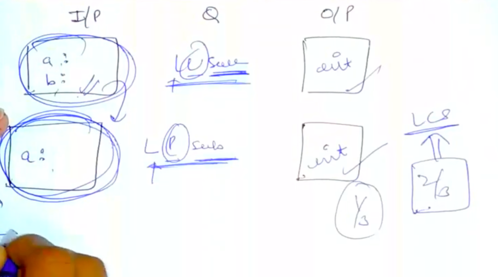
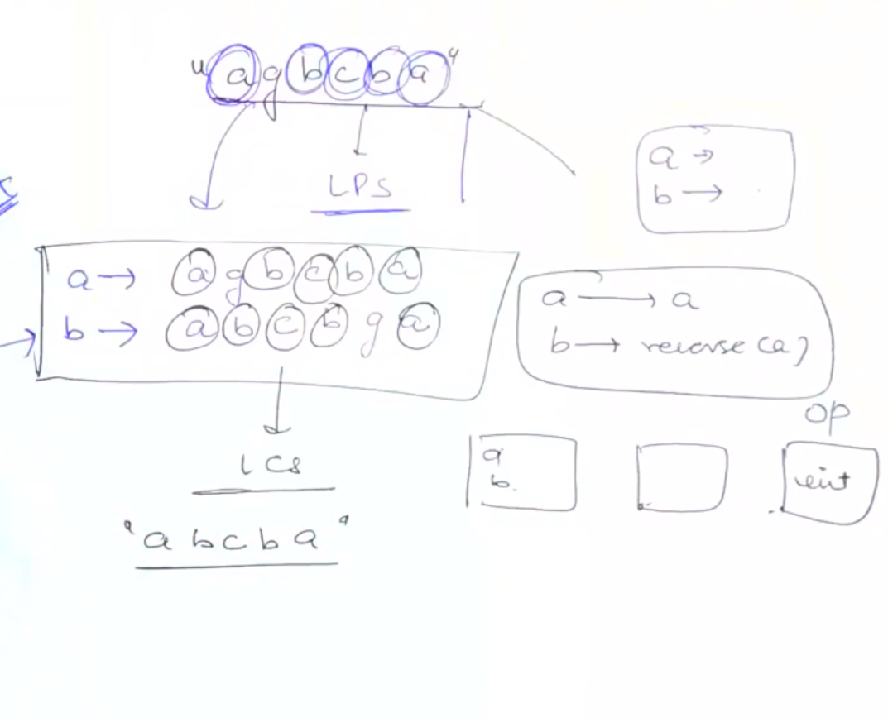

# [<](../Readme.md) 10 Largest Palindromic Subsequence

This is a pattern in itself. But we can relate LCS to this Longest Palindromic Subsequence.

## [Problem Statement](https://www.geeksforgeeks.org/problems/longest-palindromic-subsequence-1612327878/1?itm_source=geeksforgeeks&itm_medium=article&itm_campaign=practice_card)
Given a String, find the longest palindromic subsequence.

_NOTE: Subsequence of a given sequence is a sequence that can be derived from the given sequence by deleting some or no elements without changing the order of the remaining elements_

```text
Input:
s = "agbcba"

Output: 5

Explain: The longest palindromic subsequence => "abcba" of length 5.
```

## Is this LCS?
- Yes, A palindromic subsequence at its core is a Subsequence. 
- We know one question of Subsequence which is LCS.
- We can follow matching algorithm
- Match input, output and Q.
  - 
- WE can see input is not matching, so, what we can do is. since the question is about palindromic subsequence.
- WE can make a second string which is the reverse of the first string...

### How it is related to LCS?
- Once we make another string which is reverse of the first one.
- We can use LCS to find the palindromic subsequence.
- Explanation:
  - s = "agbcba"
  - let's create r = "abcbga" (reverse of s)
  - Now try to find the longest common subsequence in there.
  - We will get "abcba" as the answer
  - Which is nothing but a palindromic subsequence of the original string

## Variation
- As we explained above. 
- We need to create one string on our own (reverse of original), and then call LCS code with this strings

### Code Variation
```java
static int lps(String s1) {
    int m = s1.length();
    // Create a new string which is reverse of s1 
    String s2 = "";
    for (int i = m - 1; i >= 0; i--) {
        s2 = s2 + s1.charAt(i);
    }
    return lcs3(s1, s2, m, m);
}
```

## Thinking of LCS


## Completed Code
```java
class LPSDP{
    // Same as LCS
    static int lcs3(String s1, String s2, int m, int n) {
        int[][] dp = new int[m + 1][n + 1];
        // Initialize
        for (int i = 1; i <= m; i++) {
            for (int j = 1; j <= n; j++) {
                if (i == 0 || j == 0) {
                    // if either of the string is empty the LCS length will be 0
                    dp[i][j] = 0;
                }
            }
        }

        for (int i = 1; i <= m; i++) {
            for (int j = 1; j <= n; j++) {
                if (s1.charAt(i - 1) == s2.charAt(j - 1)) {
                    dp[i][j] = dp[i - 1][j - 1] + 1;
                } else {
                    dp[i][j] = Math.max(dp[i - 1][j], dp[i][j - 1]);
                }
            }
        }

        return dp[m][n];
    }
    
    static int lps(String s1) {
        int m = s1.length();
        // Create a new string which is reverse of s1 
        String s2 = "";
        for (int i = m - 1; i >= 0; i--) {
            s2 = s2 + s1.charAt(i);
        }
        return lcs3(s1, s2, m, m);
    }
}
```