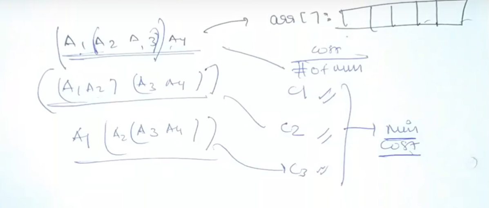
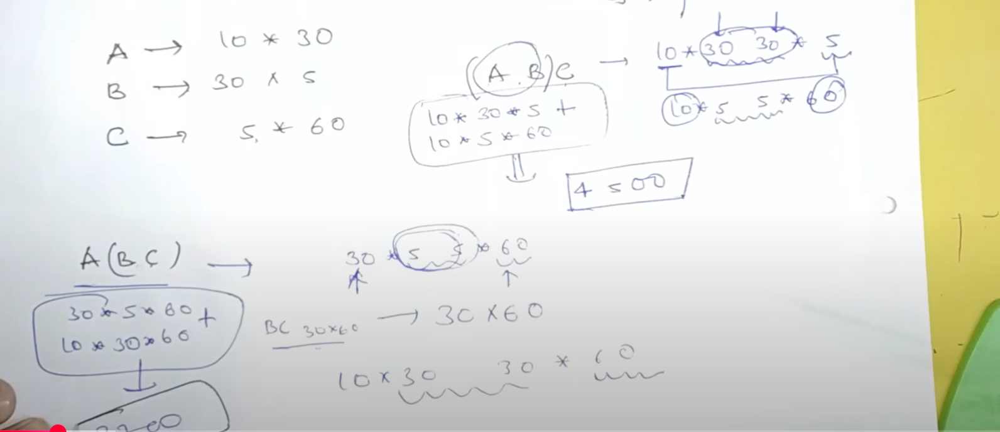
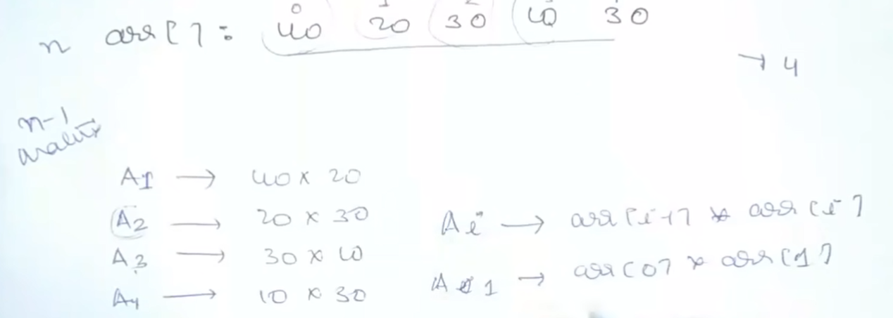
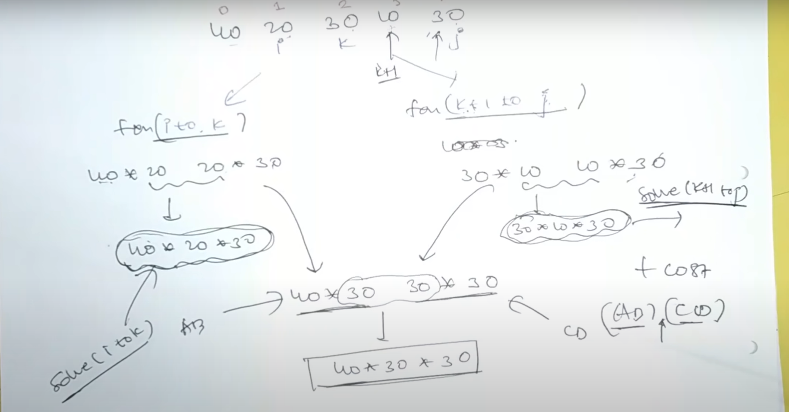

# [<](../Readme.md) 00 Matrix Chain Multiplication

## [Problem Statement](https://www.geeksforgeeks.org/matrix-chain-multiplication-dp-8/)
Given the dimension of a sequence of matrices in an array arr[], where the dimension of the ith matrix is (arr[i-1] * arr[i]), the task is to find the most efficient way to multiply these matrices together such that the total number of element multiplications is minimum. When two matrices of size m*n and n*p when multiplied, they generate a matrix of size m*p and the number of multiplications performed is m*n*p.

## Explain




## Identify
- We don't know what combination is correct!
- We have to try each combination and solve it recursively to reach to a solution...
- We need to follow steps explained in the format code...
- We have to return the cost

## Template Code
```java
int solve(int[] arr, int i, int j) {
    // Base Condition
    if (j < i) {
        return 0;
    }
    int ans = 0;
    for (int k = i; k < j; k++) {
        int temp = solve(arr, i, k) + sovle(arr, k+1, j); // The function will depend on question
        ans = max(ans, temp); // depends on the question
    }
    
    return ans;
}
```

## 1. Choice of `i` and `j`
- We have to choose i and j
- looking at how we calculate the dimensions
- i = 1, j = size - 1

## 2. Find base condition
- Let's check i == j:
- This gives list of size 1
- Can this be a matrix? No, so this is the invalid input becomes our base condition

## 3. find range of `k`
- We have to make sure 2 partitions that we have are going to have should be valid
- if K ranges from i to j: 2nd partition will be empty array
- if K ranges from i to j - 1: 2nd partition will be arr with 1 element

## Calculate the cost of resultant matrix
- How to get the cost of final last multiplication?

- 40 ==> arr[i - 1]
- 30 ==> arr[k]
- 30 ==> arr[j]

## Code using Template
```java
class MCM{
    public static int solve(int[] arr, int i, int j) {
        // Base Condition j <= i (arr size 1 or less)
        if (j <= i) return 0;
        
        int ans = Integer.MAX_VALUE;
        // Else, try all the possible values for `k`
        for (int k = i; k < j; k++) {
            // Temp 1 answer + Temp answer 2
            int temp = solve(arr, i, k) +
            solve(arr, k + 1, j) + arr[i-1] * arr[k] * arr[j];
            ans = Math.min(ans, temp);
        }
        
        return ans;
    }
}

```