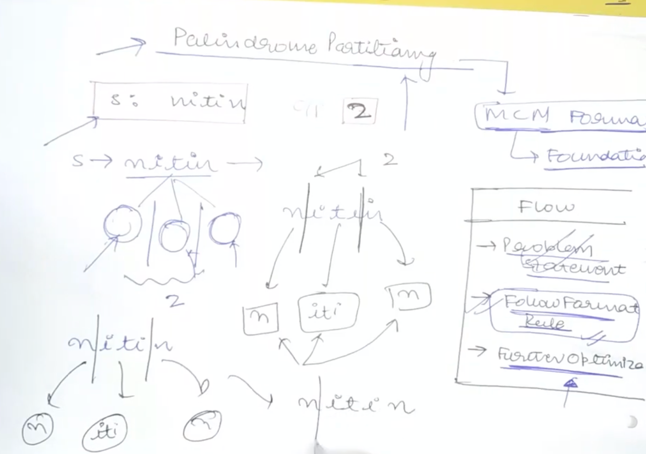
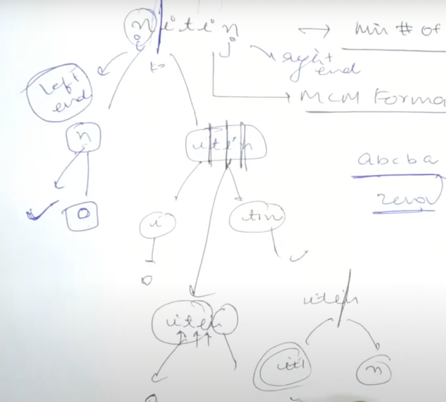

# [<](../Readme.md) 01 Palindrome Partitioning

## [Problem Statement](https://www.geeksforgeeks.org/palindrome-partitioning-dp-17/)
Given a string s, the task is to find the minimum number of cuts needed for palindrome partitioning of the given string. A partitioning of the string is a palindrome partitioning if every sub-string of the partition is a palindrome.

### Examples
```text
Input: s = “geek” 
Output: 2 
Explanation: We need to make minimum 2 cuts, i.e., “g | ee | k”.

Input: s= “aaaa” 
Output: 0 
Explanation: The string is already a palindrome.

Input: s = “ababbbabbababa” 
Output: 3
Explanation: We need to make minimum 3 cuts, i.e., “aba | bb | babbab | aba”.
```

### Follow Format Rule for MCM?
- How many partitions do we need to have in the string "nitin" such that each partitioned string is a palindrome itself.

- We have to minimize that number and give that as an answer.

#### Identify MCM 
- Min # of partitions
- We take left pointer and right pointer and see where we can put the partitions?

- Can we see how this relates to MCM?
  - Yes

#### Format - Rules
- We can convert the general format to specific format for any question by following 4 steps
  - Step 1: Find value of `i` and `j`
    - instead of array we are sending a string
    - for this problem
      - `i = 0` is safe
      - `j = len(str) - 1` is safe
  - Step 2: Find Base Condition
    - ```if (i > j) return 0```
    - for this problem
      - if the size of the string is 0 or 1 return 0
      - if the string itself is a palindrome return 0
      - `if (i >= j || isPalindrome(subStr)) return 0`
  - Step 3: k loop values
    - Depends on what is valid
    - for this problem
      - we can partition between i to j - 1 (because we will use `k+1`)
      - k : from k = i to j - 1.
        - partition schemen (i to k) and (k+1 to j)
  - Step 4: How to get to answer?
    - get minimum of the temp answer we will be calculating.
    - for this problem
      - We need minimum, so we will, calculate temp answer like this
        - ```java
          int ans = Integer.MAX_VALUE;
          for(int k = 0; k < j; k++){
            int temp = solve(s, i, k) + solve(s, k + 1, j) + 1; // 1 is to calculate
            ans = min(ans, temp);
          }
          return ans;
          ```


### Code
```java
class Solution {
    public static int solve(String s, int i, int j) {
      if (i >= j) return 0;
      if (isPalindrome(s, i, j)) return 0;
      int ans = Integer.MAX_VALUE;
      for (int k = i; k < j; k++) {
          int temp = solve(s, i, k) + solve(s, k+1, j) + 1;
          ans = min(ans, temp);
      }
      return ans;
    }
}
```

## Optimize the code
- We can now try and optimize this code using bottom up DP approach.
- We are skipping the memoization step

### Why Needed?
- This is required because we will have overlapping solutions.
- I think we have gotten the drill by now...

### Code Variation
1. Figure out the dimensions of the `dp`
   - look for parameters that change these will help find the dimensions 
   - `j` and `i` (depends on the string length)
   - so the table will be from `n X n`
2. Initialize the entire matrix with `-1`
3. Check if `dp[i][j] == -1` then have the logic run and before returning save the answer in `dp` again
4. If `dp[i][j] != -1` then return the stored value avoiding any repeat work.

```java
class Solution {
  // dp has to be set to -1 before we start this algorithm
  // i = 0
  // j = len(s) - 1 when we start
  
    public static int solveMemo(String s, int i, int j, int[][] dp) {
      if (dp[i][j] != -1) return dp[i][j];
      if (i >= j) return 0;
      if (isPalindrome(s, i, j)) {
          dp[i][j] = 0;
          return dp[i][j];
      }
      int mn = Integer.MAX_VALUE;
      for (int k = i; k < j; k++) {
        int temp = solveMemo(s, i, k, dp) + solveMemo(s, k + 1, j, dp) + 1;
        mn = Math.min(mn, temp);
      }
      dp[i][j] = mn;
      return mn;
    }
}
```

### More Optimized
- We have to now optimize what we have here in memoized
- We have to check subproblems as well
```java
    public static int solveMemoOptimized(String s, int i, int j, int[][] dp) {
      if (dp[i][j] != -1) return dp[i][j];
      if (i >= j) return 0;
      if (isPalindrome(s, i, j)) {
          dp[i][j] = 0;
          return dp[i][j];
      }
      int mn = Integer.MAX_VALUE;
      for (int k = i; k < j; k++) {
        int left;
        int right;
        if (dp[i][k] != -1) {
            left = dp[i][k];
        } else {
            left = solveMemo(s, i, k, dp);
        }
        if (dp[k + 1][j] != -1) {
            right = dp[k + 1][j];
        } else {
            right = solveMemo(s, i, k, dp);
        }
        int temp = left + right + 1;
        mn = Math.min(mn, temp);
      }
      dp[i][j] = mn;
      return mn;
    }
```