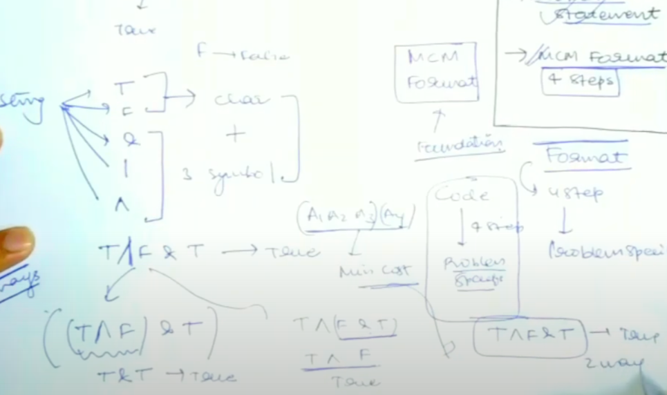

# [<](../Readme.md) 02 Evaluate Expression to True 

## [Problem Statement](https://www.geeksforgeeks.org/boolean-parenthesization-problem-dp-37/)
Given a boolean expression s with the following symbols and operators filled between symbols. The task is to count the number of ways we can parenthesize the expression so that the value of the expression evaluates to true.

Symbols

T —> true
F —> false
Operators

& —> boolean AND
| —> boolean OR
^ —> boolean XOR

### Examples
```text
Input: s = T|T&F^T
Output: 4
Explanation: The expression evaluates to true in 4 ways ((T|T)&(F^T)), (T|(T&(F^T))), (((T|T)&F)^T) and (T|((T&F)^T)).


Input: s = T^F|F
Output: 2
Explanation: ((T^F)|F) and (T^(F|F)) are the only ways.
```

### MCM Format 
- Changes are, we have to put brackets instead of partitioning
- How many ways can we use to evaluate the expression to True


### Sum up
- The question gives us a string as an input with the given symbols
- We have to add paranthesis to the string such that it evaluates to True
- example
```text
  s = "T|F&T^F"
  we have find # of ways to evaluate this to True.
```
- If we think about it, between every 3 symbols we can try to put the bracket and see if it evaluates to True or not?
- If yes, count 1 else count 0
- Also, we will always break on an operator and not a T/F

### 4 Step Routine
- Step 1: Find value of `i` and `j`
    - instead of array we are sending a string
    - for this problem
        - `i = 0` is safe (because that is the first symbol other than T/F)
        - `j = len(str) - 1` is safe (because it is the last symbol other than T/F)
    - Step 2: Find Base Condition
        - for this problem
            - `if (i > j) return 0`
            - ```java
                if (i == j) {
                    if (isTrue == true) return s[i] == 'T';
                    else {
                        return s[i] == 'F';
                    }
                }
              ```
    - Step 3: k loop values
        - for this problem
            - we can partition between i+1 to j - 1 (because we will use `k+1`)
            - k : from k = i + 1 to j - 1. (with incr of 2)
                - partition scheme (i to k - 1) and (k+1 to j)
                - ```java
                    for(int k = i + 1; k <= j - 1; k+=2) {
                        int lT = solve(s, i, k - 1, T);
                        int lF = solve(s, i, k - 1, F);
                        int rT = solve(s, k + 1, j, T);
                        int rF = solve(s, k + 1, j, F);
                    }
                  ```     
    - Step 4: How to get to answer?
        - get minimum of the temp answer we will be calculating.
          - for this problem
              - We need minimum, so we will, calculate temp answer like this
                ```java
                  int ans = 0;
                  for(int k = i + 1; k < j - 1; k++){
                        int lT = solve(s, i, k - 1, T);
                        int lF = solve(s, i, k - 1, F);
                        int rT = solve(s, k + 1, j, T);
                        int rF = solve(s, k + 1, j, F);
                        if (s[k] == '&') {
                            if (isTrue == True) {
                                ans += lT * rT // T & T == T
                            } else {
                                ans += lF * rT + lF * rF + lT * rF; 
                            }
                        } else if (s[k] == '|') {
                            if (isTrue == True) {
                                ans += lT * rT + lT * rF + lF * rT
                            } else {
                                ans += lF * rF // F | F == F
                            }
                        }
                        else if (s[k] == '^') {
                            if(isTrue == True){
                                ans += lT * rF + lF * rT
                            } else {
                                ans += lT * rT + lF * rF
                            }
                        }
                 }
                 return ans;
            ```
### Code
```java
class Solution {
    
}
```