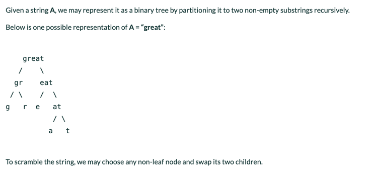
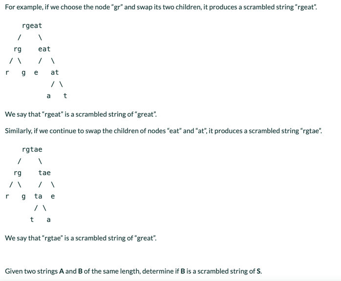
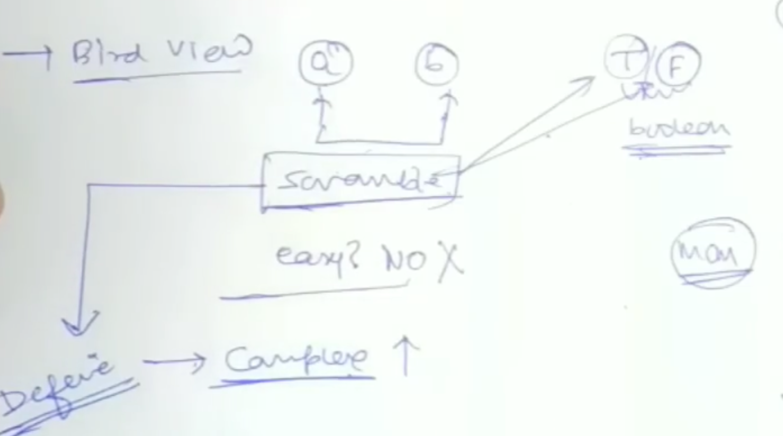
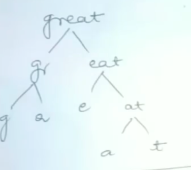
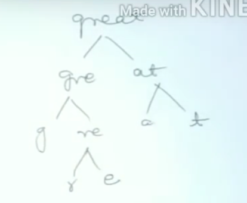
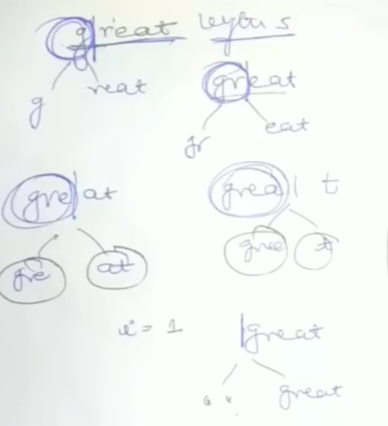
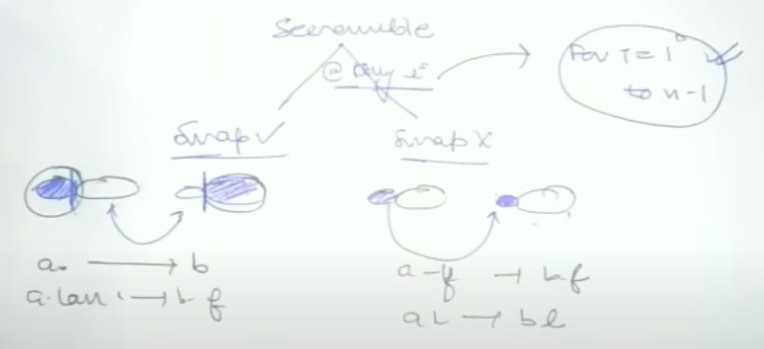

[<](../Readme.md) 05 Scramble String

# [Problem Statement](https://www.interviewbit.com/problems/scramble-string/)



```text
Input Format:

The first argument of input contains a string A.
The second argument of input contains a string B.
Output Format:

Return an integer, 0 or 1:
    => 0 : False
    => 1 : True
Constraints:

1 <= len(A), len(B) <= 50
Examples:

Input 1:
    A = "we"
    B = "we"

Output 1:
    1

Input 2:
    A = "phqtrnilf"
    B = "ilthnqrpf"
    
Output 2:
    0
``` 



We are given a string `a`. We can convert it to a binary tree. Like shown above.
Then, a child should never be `""` (empty string).
These are the only 2 constrains we have.
Example breakdown 1:



Example breakdown 2:



We choose a nonleaf node, and swap its 2 children and find the new string. 
We can swap multiple nodes. OR we can swap 0 nodes as well.

## How to identify?
Where can we apply swapping? 
- We need to find a partition where we can swap.
- So we get a similarity with MCM.
- Partitioning will start from 1 and go to len - 1



- `i = 1 to n - 1`
- We found the range for `i`. 
- We figured out that this is similar to MCM.

## How to approach?
- How can we make this look simple?
  - It is still recursive.
  - It is still MCM.
  - But Scrambling is still new.
- How to approach scrambling?
  - we can do 0 swaps.
  - we can any number of swaps

## How to breakdown?
- We can break this problem down in partitioning
- Then choice problem of either swap or NO Swap
- At each break we have to check if br1 of first string is sramble of br2 of second string?


## Base Conditions
- length of both strings is not equal => return False
- if both strings are empty => return True
- if a.compare(b) == 0 => return True
- if a.length <= 1 return False 
- else:
  - Recursive logic

## Code
```java
public static boolean solve(String a, String b) {
    if (a.compareTo(b) == 0) {
      return true;
    }
  if (a.length() <= 1) {
    return false;
  }
  
  int n = a.length();
  
  boolean flag = false;
  
  for (int i = 1; i < n - 1; i++) {
    boolean condition1 = sovle(a.substring(0, i), b.substring(n-i)) == true && solve(a.substring(n-i), b.substring(0, i)) == true;
    boolean condition2 = sovle(a.substring(0, i), b.substring(0, i)) == true && solve(a.substring(n-i), b.substring(n-i)) == true;
    if (condition1 || condition2){
        flag = true;
        break;
    }
  }
  return flag;
}
```

## Convert it to Bottom Up DP
- We will just add 4 lines to this code and convert it to memoized DP

```text
a: great
b: rgate
```

### Why memoization is needed?
- We have more than 1 recursive call
- so, we will have overlapping sub-problems which we need to avoid re-calculating
- Preventing recalculation is the way to go...

### What DS do we use for memoization?
- We will use a map, because it is going to be bigger that 2D.
- Find the variables that are changing
- Changing Variables "a" and "b"

### Code Variation
```java
public static boolean solveMemo(String a, String b, Map<String, Boolean> hmap) {
  if (a.compareTo(b) == 0) return true;
  if (a.length() == 0 || b.length() == 0) return false;
  if (a.length() == 1) return false;
  String key = a + " " + b;
  if (hmap.containsKey(key)) {
    return hmap.get(key);
  }
  int n = a.length();
  boolean flag = false;
  for (int i = 1; i < n; i++) {
    boolean swapped = solveMemo(a.substring(0, i), b.substring(n - i), hmap) == true
            && solveMemo(b.substring(i), a.substring(0, n - i), hmap) == true;
    boolean notSwapped = solveMemo(a.substring(0, i), b.substring(0, i), hmap) == true
            && solveMemo(a.substring(i), b.substring(i), hmap) == true;

    if (swapped || notSwapped){
      flag = true;
      break;
    }
  }
  hmap.put(key, flag);
  return flag;
}
```