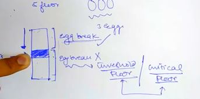

[<](../Readme.md) 06 Egg Dropping Problem

## [Problem Statement](https://www.geeksforgeeks.org/egg-dropping-puzzle-dp-11/)

The following is a description of the instance of this famous puzzle involving N = 2 eggs and a building with K = 36 floors.
Suppose that we wish to know which stories in a 36-story building are safe to drop eggs from, and which will cause the eggs to break on landing. We make a few assumptions:

An egg that survives a fall can be used again.
A broken egg must be discarded.
The effect of a fall is the same for all eggs.
If an egg breaks when dropped, then it would break if dropped from a higher floor.
If an egg survives a fall then it would survive a shorter fall.
It is not ruled out that the first-floor windows break eggs, nor is it ruled out that the 36th-floor does not cause an egg to break.


O/p Expected : Minimum Number of Attempts required in finding the critical floor.

```text
Example:

i/p: e = 3, f = 5
o/p: 3

3 is the minimum number of attempts to find out the critical floor in the worst case scenario.

Explain:
Minimum attempts required: 3
Sequence: Floor 2 → Floor 4 → Floor 5 (or 3 if needed).
```


## MCM Pattern
- We have to employ the best strategy to use the eggs wisely, when finding the critical floor.
- We have an array in MCM. Here we have a building of `f` floors. (vertical array)
- Now we have to find i and j, on which k will iterate: that has to be => 1 to f all the values.
  - because there is no problem for the edge values of k.
- We have to try all these k values.
  ```java
      for(int k = 1; k <= f; k++) {
          // Logic for checking if K is the criticle floor
      }
  ```
- Another base condition:
  - if we have:
    - eggs = 0 we dont have any attempts => 0
    - eggs = 1 we will return f (we start at bottom and move up iteratively)
    - floors = 0 we dont have any floor => 0
    - floors = 1 we only have 1 floor => 1 
      - when we throw egg from that floor  
        - if breaks then the threshold floor is 0 (required attempt 1)
        - if does not break then threshold floor is 1 (required attempt 1)
        ```java
          if (e == 0) return 0;
          if (e == 1) return f;
          if (f == 0 || f == 1) return f;
        ```
- Recursive Calls:
  - solve(e, f) 
    - If Egg Breaks: solve(e - 1, i - 1) => Critical floor is below ith floor
    - If Doesn't: solve(e, f - i) => Critical floor is above ith floor (number of floors above i are (f - i))
  - Temp Answer Generation: Sum of 
    - 1 (we have used one attempt at ith floor)
    - Max (If Egg Breaks, If Doesn't)
  - Answer will be minimum of existing answer and temp generated.
_Note: We are using max to calculate Temp answer, because we have to consider "WORST" case scenario.
We are using min to calculate the final answer, because we have to minimize the number of attempts._
```java
// Code should look something like this
class EggDropping {
    public static int solve(int eggs, int floors) {
        // Setup all the base-cases
        if (eggs == 0) return 0;
        if (eggs == 1) return floors;
        if (floors == 1 || floors == 0) return floors;
        
        int ans = Integer.MAX_VALUE;
        
        // Loop over k values
        for (int k = 1; k <= floors; k++) {
            // calculate breaks
            int breaks = solve(eggs - 1, floors - 1);
            int doesntBreak = solve(eggs, floors - k);
            
            int temp = 1 + Math.max(breaks, doesntBreak);
            ans = Math.min(ans, temp);
        }
        
        return ans;
    }
}
```

## Memoized Approach
To memoize lets use a map, instead of a traditional table.
- Create a map to store computed results.
- Pass the map
- If answer is present in the map => return early
- else compute the answer store it in the map and return the answer.
```java
// 4 Changes

// Change 1 will be in main method. where memo is set to an empty hashmap.

public static int solveMemo(int eggs, int floors, HashMap<String, Integer> memo) { // Change 2
  // Setup all the base-cases
  if (eggs == 1) return floors;
  if (floors == 1 || floors == 0) return floors;
  // Change 3
  String key = eggs + "-" + floors;
  if (memo.containsKey(key)) return memo.get(key);

  int ans = Integer.MAX_VALUE;

  // Loop over k values
  for (int k = 1; k <= floors; k++) {
    // Level 2 -> Memoization Step 1
    String key1 = (eggs - 1) + "-" + (k - 1);
    String key2 = eggs + "-" + (floors - k);
    // Level 2 -> Memoization Step 2
    if(!memo.containsKey(key1)) {
      memo.put(key1, solveMemo(eggs - 1, k - 1, memo));
    }
    int breaks = memo.get(key1);
    // Level 2 -> Memoization Step 2
    if (!memo.containsKey(key2)) {
      memo.put(key2, solveMemo(eggs, floors - k, memo));
    }
    int doesntBreak = memo.get(key2);

    int temp = 1 + Math.max(breaks, doesntBreak);
    ans = Math.min(ans, temp);
  }
  // Change 4
  memo.put(key, ans);
  return ans;
}

```